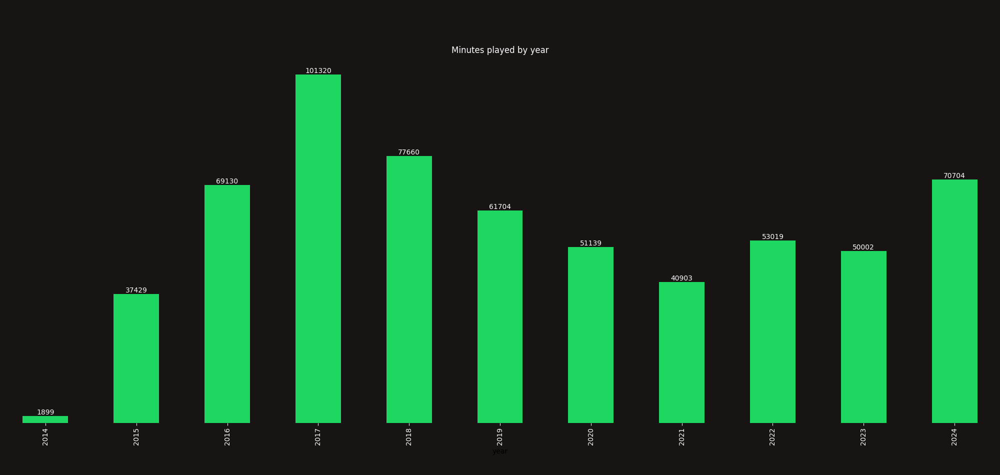

# Welcome to my Spotify data analyser

This script analyses all JSON data provided by Spotify and display the information based on supplied flags

## Dependencies

All deps are in requirements.txt and can be installed with `pip3 install -r requirements.txt`  

## Running

run `main.py -h` to see all options

## Screenshots

Example of yearly minutes played by year

