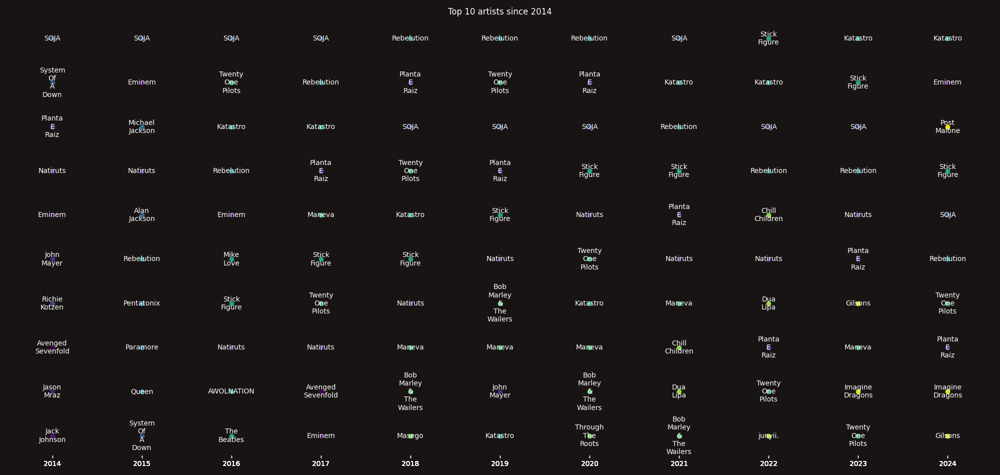

# Welcome to my Spotify data analyser

This script analyses all JSON data provided by Spotify and display the
information based on supplied flags

## Dependencies

All deps are in requirements.txt and can be installed with
`pip3 install -r requirements.txt`

## Running

> [!NOTE]
> install the requirements with pip3 install -r requirements.txt

### Running locally

run `main.py -h` to see all options

### Running with Docker

```bash
docker build --tag spotify-analyser .
docker run spotify-analyser
```

> [!NOTE]
> top_genres mode requires a valid [Spotify for developer](https://developer.spotify.com/) CLIENT_ID and CLIENT_SECRET.

## Screenshots

Example of yearly minutes played by year


Examples of top_artists graph plot


